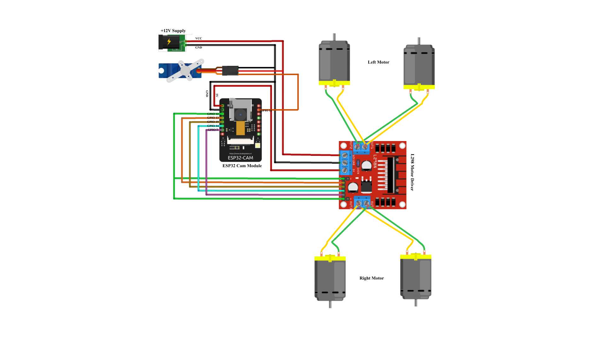

# Home Surveillance Bot  

An IoT-enabled **mobile surveillance robot** using **ESP32-CAM** and a **Flutter mobile application**.  
The system provides real-time video streaming, secure authentication, and remote mobility control over Wi-Fi, making it a **low-cost alternative to CCTV** for home and indoor security.  


## 📌 Features  

- **Live video streaming** from ESP32-CAM over Wi-Fi  
- **Secure authentication** via Flutter mobile app  
- **Remote navigation control** (forward, backward, left, right, stop)  
- **15m indoor coverage range** (tested in real environments)  
- **Low latency (~220ms)** video transmission  
- Compact, low-cost, and energy-efficient design  


## Hardware Requirements  

- ESP32-CAM module  
- L298N Motor Driver  
- DC Motors + Self made Chassis + Wheels  
- Power Supply (Li-Ion battery / USB power bank)  
- Jumper wires, breadboard, connectors  


## Software Requirements  

- Arduino IDE (with ESP32 board support)  
- Flutter SDK (for mobile app)  
- Android Studio / VS Code for app development  
- Firebase (optional, if using authentication backend)  


## Setup Instructions  

### 1. **ESP32-CAM Firmware**  
- Install Arduino IDE  
- Add ESP32 board support (via board manager)  
- Upload `esp32CamCode.ino` to ESP32-CAM  
- Configure Wi-Fi SSID & Password in the code  

### 2. **Flutter Mobile App**  
- Install Flutter SDK  
- Clone this repository  
- Navigate to `/Flutter Code/homesurveillance` folder  
- Run `flutter pub get`  
- Connect Android device and run:  
  ```bash
  flutter run

 ## Schematic Diagram  

The following schematic illustrates the wiring connections between the **ESP32-CAM**, **L298N motor driver**, **DC motors**, and **power supply**.  

- **ESP32-CAM** handles video streaming and motor control signals  
- **L298N Motor Driver** is used to control the direction and speed of DC motors  
- **DC Motors** provide mobility for the surveillance robot  
- **Power Supply** (Li-Ion battery or USB power bank) powers both ESP32-CAM and motor driver  

  

> *Note: Ensure that the power supply voltage matches the ESP32-CAM and motor driver requirements to prevent damage to components.*  

## 📜 Citation  

If you use this project for academic, research, or educational purposes, please cite it as:  

> A. Shukla,D. Yadav *“IoT-Enabled Mobile Surveillance Robot using ESP32-CAM and Flutter,”* 2025. GitHub Repository: [https://github.com/Avshek-Shukla/Home-Surveillance-Bot](https://github.com/Avshek-Shukla/Home-Surveillance-Bot)

## 📄 License  

You are free to use, modify, and distribute it, provided proper credit is given.  


